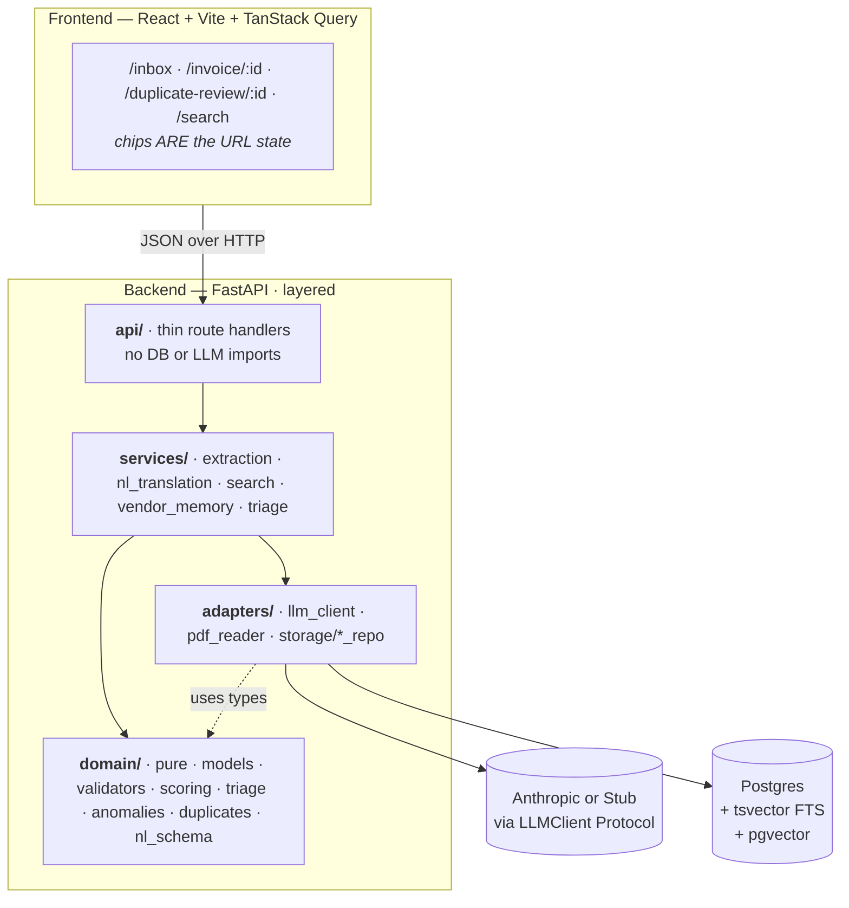
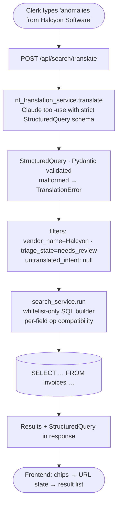
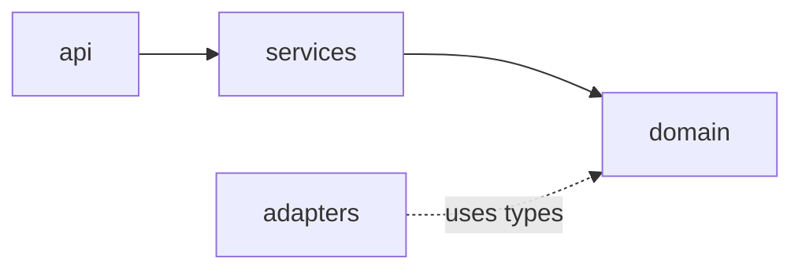

# Sift

Vendor invoices in mixed formats → clean, structured data an AP clerk can review and query.

A working end-to-end system: drag a PDF in, the pipeline extracts header fields, flags anomalies and duplicates, surfaces a typed "why" for everything that needs review, and lets a clerk query the corpus in plain English.

---

## Table of contents

1. [The problem](#the-problem)
2. [Why I picked this problem and the subset I built](#why-i-picked-this-problem-and-the-subset-i-built)
3. [60-second demo](#60-second-demo)
4. [Quick start](#quick-start)
5. [High-Level Design (HLD)](#high-level-design-hld)
6. [Low-Level Design (LLD)](#low-level-design-lld)
7. [Why an LLM pipeline over other approaches](#why-an-llm-pipeline-over-other-approaches)
8. [Data used to test accuracy](#data-used-to-test-accuracy)
9. [Real-world impact](#real-world-impact)
10. [Available commands](#available-commands)
11. [Tech stack](#tech-stack)
12. [Deployment](#deployment)
13. [Future work](#future-work)
14. [References](#references)

---

## The problem

Accounts-payable clerks at mid-market companies open ~50–300 vendor invoices a week. Each arrives in a different shape: a born-digital PDF, a phone-scanned image-only PDF, an emailed attachment with the totals in a footer, a vendor portal export with the tax broken into four jurisdictions.

The work an AP clerk actually does is repetitive and low-judgement most of the time, and *very* high-judgement the moment a number looks wrong. Today most teams either:

- Type fields into the ERP by hand (slow, error-prone, but the clerk reads every line).
- Use a cloud OCR API (fast, but a black box — no signal for "this $89k invoice looks 200× larger than every prior invoice from this vendor", no duplicate detection that survives a re-send).

Sift is the middle path: **extract automatically, surface the specific reasons a row needs a human, and make the corpus queryable from a single search box.** The clerk's attention is the scarce resource — every screen is designed around concentrating it on the rows that actually need it.

---

## Why I picked this problem and the subset I built

I picked "messy documents → structured queryable data" because invoices are the canonical version of that problem: structured enough that an LLM can do real work, unstructured enough that getting it right requires more than calling an API.

**The full problem is enormous.** Invoices in 30+ languages, multi-currency conversions, ERP write-back, approval workflows, vendor portal scraping, fraud detection across organisations, line-item taxonomy reconciliation. Building that in five days produces a shallow demo of everything and a deep version of nothing.

So I cut hard. The subset I built is:

| Kept in scope | Why |
|---|---|
| English single-currency vendor invoices, digital + scanned PDFs | Covers ~80% of real AP inflow at a mid-market US/EU company |
| Header fields (vendor, invoice #, dates, subtotal/tax/total, currency) | The data the clerk actually keys into the ERP |
| Per-field bounding boxes with hover-highlight | The clerk needs to verify a value against the source in one glance, not by hunting through a PDF |
| A three-state triage system (`confident` / `needs_review` / `likely_duplicate`) | Inbox should answer "what needs me?" before "what is this?" |
| Typed reason cards (math fail, anomaly, duplicate, low-confidence, missing field, unseen vendor, extraction failed) | Generic "model uncertain" is useless; specific cause is actionable |
| Composite confidence with cascade-agreement override | LLMs are systematically overconfident on plausible-but-wrong values; structural validators + per-vendor history beat self-reported confidence |
| Tiered model cascade (Haiku → Sonnet → Opus) | Cost and latency on the easy 80%; depth and accuracy on the hard 20% |
| Plain-English search (NL→SQL via tool-use into a typed `StructuredQuery`) | The "queryable" half of the promise — but constrained so the LLM can never produce arbitrary SQL |
| Stub provider for the entire LLM seam | A reviewer can clone, demo, and read the code with zero API spend |

| Deliberately left out | Why |
|---|---|
| Active learning (clerk-correction → vendor memory → auto-fill next time) | All the bones are there (`field_corrections` table, `vendors.memory` shape, `source: memory-applied` field) — just not wired to close the loop. A focused 4–6 hour follow-up. |
| Multi-currency invoices | Surfaces in the export schema, never as pixels in the demo. Cut early to hold the quality bar on the rest. |
| Vision-path line items and tax breakdown | Returns `[]` on scanned PDFs. The vision tool-use schema could be extended but the eval gate said "ship the parts that are reliable, document the rest." |
| ERP write-back / approval workflows | Out of scope; this is the extract→review→query loop, not an AP automation suite |
| Handwritten invoices, non-English invoices | Different model class, not a 5-day problem |

The cuts are documented per ADR so the reasoning survives the build. See [`docs/adr/`](./docs/adr/).

---

## 60-second demo

The product is built around three demo beats plus a queryable fourth:

1. **It understands messy.** Drop a scanned-image PDF on the inbox. The pipeline routes it through the vision path, returns header fields with per-field bounding boxes, and renders the review screen with hover-highlight overlays on the PDF — every field is one mouse-over away from being verifiable against the source.
2. **It catches what a clerk would catch.** An $89,000 Halcyon Software invoice lands flagged `needs_review` with two reason cards stacked: `anomaly` (`Z=219 vs vendor mean $34,250 ±$250`) and `low_confidence` (cascade agreement override fired). The clerk sees *why* in one glance.
3. **It refuses to be fooled by a re-send.** A second visually-identical Vega invoice arrives. It flags as `likely_duplicate`, opens a 3-pane review (original PDF · new PDF · field diff), and the clerk decides in seconds.

Plus the queryable half:

4. **It's actually queryable.** Type `anomalies from Halcyon Software` at `/search`. The NL translator returns a typed `StructuredQuery`; chips appear in the URL; the result list shows the $89k row. Hit "Export CSV" and the file ships with the serialized query in its header — a self-describing audit trail.

Everything in those four beats lives in `make demo`.

---

## Quick start

Prerequisites: Docker + Docker Compose. Nothing else — Python, Node, and Postgres all run inside containers.

```bash
git clone <repo-url>
cd sift
cp .env.example .env       # defaults are safe for local — no API key needed
make demo                  # = reset-db + seed 7 curated invoices that exercise every beat
open http://localhost:5173
```

`make demo` runs the full pipeline with `SIFT_LLM_PROVIDER=stub`. Every LLM call goes through `StubLLMClient`, which returns deterministic canned extractions that exercise the entire cascade (Haiku → Sonnet → Opus → agreement override). **Zero API key. Zero credits burned.**

To run against real models, edit `.env`:

```env
SIFT_LLM_PROVIDER=anthropic
ANTHROPIC_API_KEY=sk-ant-...
```

The provider abstraction (ADR-0005) makes this a single setting flip. Adding an OpenAI or local provider is one new class implementing the `LLMClient` Protocol + one factory branch.

---

## High-Level Design (HLD)



### Request flow: upload → review

```mermaid
flowchart TD
    Start([Clerk uploads PDF])
    Post["POST /api/invoices"]
    Hash["Hash file · dedupe by SHA-256"]
    Extract["extraction_service.extract_from_pdf"]
    Branch{has_text&#40;pdf&#41;?}
    Digital["<b>Digital path</b><br/>PyMuPDF text + bboxes<br/>→ Haiku extract"]
    Scanned["<b>Scanned path</b><br/>pdf2image →<br/>vision LLM &#40;Sonnet&#41;"]
    Validators["validators · math, format, required"]
    Composite["composite_confidence<br/>min&#40;structural, history&#41;"]
    CascadeCheck{Cascade trigger?<br/>low conf · math fail · unseen vendor}
    Cascade["Escalate Haiku → Sonnet → Opus"]
    Agreement["Cascade-agreement override<br/>on disputed fields"]
    Anomaly["Anomaly check · Z-score vs vendor history"]
    Duplicate["Duplicate check · perceptual hash + content fingerprint"]
    Triage["derive_triage →<br/>confident · needs_review · likely_duplicate"]
    Persist["Persist Extraction row · is_current=true"]
    Return([Return InvoiceOut DTO])

    Start --> Post --> Hash --> Extract --> Branch
    Branch -->|yes| Digital
    Branch -->|no| Scanned
    Digital --> Validators
    Scanned --> Validators
    Validators --> Composite --> CascadeCheck
    CascadeCheck -->|no| Anomaly
    CascadeCheck -->|yes| Cascade --> Agreement --> Anomaly
    Anomaly --> Duplicate --> Triage --> Persist --> Return
```



### Request flow: NL search



### Layered architecture rules (CI-enforced)

Strict one-way dependencies, checked on every commit by `import-linter`:



- `api/` is a thin shell. It parses requests, calls one service method, serialises the response. No DB or LLM imports.
- `services/` orchestrates. Knows about `domain/` and `adapters/`.
- `domain/` is pure. No I/O, no DB session, no network. The eval harness sits on this seam — it can run domain logic without spinning up containers.
- `adapters/` are the I/O seams. `LLMClient` is a `Protocol`; `AnthropicLLMClient` and `StubLLMClient` implement it. Swapping is a one-line factory change.

---

## Low-Level Design (LLD)

### Backend module map

```
backend/app/
├── api/                      thin FastAPI routers
│   ├── invoices.py           POST/GET /api/invoices (+ confirm, dismiss, retry, mark-unprocessable)
│   ├── search.py             POST /api/search/translate, GET /api/search
│   ├── anomalies.py          per-vendor stats endpoint
│   └── auth.py               clerk auth (cookie session)
├── services/                 orchestration layer
│   ├── extraction_service.py extract_from_pdf — the single entry point for the pipeline
│   ├── cascade.py            Haiku→Sonnet→Opus orchestrator + agreement scoring
│   ├── nl_translation_service.py  NL → StructuredQuery
│   ├── search_service.py     StructuredQuery → SQL builder + executor
│   ├── vendor_memory_service.py   running per-vendor stats (Welford-style), memory consolidation
│   ├── invoice_queries.py    read-side serialisation (Invoice + Extraction → DTO)
│   ├── clerk_actions.py      confirm / dismiss-duplicate / mark-unprocessable / retry
│   ├── anomaly_service.py    Z-score against vendor history
│   └── auth_service.py
├── domain/                   pure functions, fully unit-tested
│   ├── models.py             Pydantic DTOs + TriageReason discriminated union
│   ├── validators.py         math reconcile, format checks, required-field checks
│   ├── scoring.py            structural_score, history_score, cascade-agreement score
│   ├── confidence.py         composite_confidence = min(structural, history) + override
│   ├── triage.py             derive_triage from reasons + confidence
│   ├── anomalies.py          Z-score logic + AnomalyReason payload shape
│   ├── duplicates.py         phash + content-fingerprint similarity
│   └── nl_schema.py          StructuredQuery + per-field operator compatibility table
├── adapters/                 I/O seams
│   ├── llm_client.py         Protocol + AnthropicLLMClient + StubLLMClient + factory
│   ├── pdf_reader.py         PyMuPDF wrapper: has_text, get_words, find_tables
│   └── storage/              SQLAlchemy repositories per aggregate
├── db/                       SQLAlchemy models + Alembic migrations + session
└── prompts/                  versioned tool-use schemas + few-shot examples (content-hashed)
```

### Frontend module map

```
frontend/src/
├── routes/                   one file per screen
│   ├── InboxScreen.tsx
│   ├── ReviewScreen.tsx
│   ├── DuplicateReviewScreen.tsx
│   └── SearchScreen.tsx
├── components/
│   ├── primitives/           FieldRow · PdfViewerWithBbox · BboxOverlay · ChipFilter · ConfidenceBadge · SourceBadge
│   ├── reason-cards/         typed dispatch by reason.type → React component
│   └── command-palette/      Cmd+K — jump-to / find-similar / force-tier
├── hooks/                    useKeyboardShortcuts, useUrlState
├── state/                    TanStack Query keys + mutations
├── types/                    auto-generated from backend Pydantic at build time
└── utils/
```

### Database schema

Four tables. The 1:N from `invoices → extractions` is what makes re-extraction (active learning, retry) clean without losing audit history.

```sql
invoices (
  id UUID PRIMARY KEY,
  file_path TEXT NOT NULL,
  file_hash TEXT NOT NULL,            -- SHA-256, dedupe on upload
  perceptual_hash TEXT,                -- phash for duplicate detection
  vendor_id UUID REFERENCES vendors,
  uploaded_at TIMESTAMPTZ,
  review_status TEXT NOT NULL          -- pending | confirmed | dismissed_duplicate | unprocessable
);

vendors (
  id UUID PRIMARY KEY,
  name TEXT,
  tax_id TEXT,
  normalized_name TEXT UNIQUE,
  first_seen_at TIMESTAMPTZ,
  memory JSONB DEFAULT '{}'            -- learned rules + per-vendor numeric stats
);

extractions (
  id UUID PRIMARY KEY,
  invoice_id UUID REFERENCES invoices,
  model TEXT,                          -- which tier produced the final row
  cascade_trace JSONB,                 -- ordered list of tier calls + token usage
  extracted_fields JSONB,              -- per-field {value, bbox, page, confidence, source}
  confidence_per_field JSONB,
  predicted_triage_state TEXT,         -- confident | needs_review | likely_duplicate
  predicted_triage_reasons JSONB,      -- discriminated union of TriageReason objects
  is_current BOOLEAN,
  created_at TIMESTAMPTZ,
  raw_text_tsv tsvector GENERATED ALWAYS AS (...) STORED   -- GIN-indexed FTS
);
CREATE UNIQUE INDEX ON extractions (invoice_id) WHERE is_current = TRUE;

field_corrections (
  id UUID PRIMARY KEY,
  extraction_id UUID REFERENCES extractions,
  field_name TEXT,
  original_value TEXT,
  corrected_value TEXT,
  corrected_at TIMESTAMPTZ
);
```

### Key data shapes

**`extracted_fields` (per-field object, not bare value):**

```json
{
  "vendor_name": {
    "value": "Acme Logistics",
    "bbox": [120, 80, 340, 110],
    "page": 0,
    "confidence": 0.92,
    "source": "pymupdf+haiku"
  }
}
```

The `source` field is what enables the "this came from memory" / "this was manually corrected" badges on the review screen.

**`predicted_triage_reasons` (discriminated union — drives the typed reason cards):**

```json
[
  {"type": "math_fails", "subtotal": 1000.00, "tax": 180.00, "total": 1180.40, "delta": 0.40},
  {"type": "anomaly", "field": "total", "vendor_mean": 1180.00, "vendor_std": 142.50, "z_score": 12.4},
  {"type": "duplicate_of", "invoice_id": "...", "similarity": 0.98, "match_method": "perceptual_hash"},
  {"type": "low_confidence", "field": "invoice_number", "score": 0.42, "reason": "format_mismatch"},
  {"type": "missing_field", "field": "tax_breakdown"},
  {"type": "unseen_vendor", "vendor_name": "..."},
  {"type": "extraction_failed", "stage": "cascade_exhausted", "detail": "..."}
]
```

### Composite confidence (ADR-0003)

```
confidence = min(structural_score, history_score)
```

- `structural_score` — rule-derived. Math reconciles → 1.0 on amounts, 0.2 if it fails. Required-and-format-valid → 1.0, else 0.0. Fields without a structural rule sit at a neutral 0.9 ceiling so history governs them.
- `history_score` — per-vendor Z-score on numeric fields. `|z|<1` → 1.0; `|z|<2` → 0.85; `|z|<3` → 0.6; else 0.3. Defaults to 0.85 for cold-start vendors.
- **Cascade-agreement override** — when the cascade fires (`min_field_confidence < 0.7` OR math fails OR unseen vendor), the disputed fields' confidence is *replaced* by the cross-model agreement score (exact match → 1.0, mismatch → 0.3). LLM self-reported confidence is logged but never used as a triage input.

This is the part that catches what a clerk would catch: an LLM saying "I'm 99% sure this is a $89k invoice" gets overridden when the vendor's prior 12 invoices averaged $34k.

### NL → SQL safety (ADR-0004)

The LLM never sees SQL. It produces a `StructuredQuery` via tool-use, validated by Pydantic:

```python
class StructuredQuery(BaseModel):
    filters: list[FilterClause]       # whitelisted (field, op) pairs only
    fts_matches: list[str] | None     # routed to tsvector
    sort: SortClause | None
    limit: int = 50
    untranslated_intent: str | None   # surfaced as an amber notice in the UI
```

The SQL builder accepts only whitelisted fields and operators. Anything the LLM couldn't translate goes into `untranslated_intent` and gets shown to the clerk — *never* silently dropped.

### Failure modes (ADR-0006)

Every upload produces an `extractions` row, success or failure. Failed extractions carry `extracted_fields = {}` and a typed `extraction_failed` reason. The review screen renders an `ExtractionFailedCard` with three actions:

- **Retry** — creates a new extractions row, runs the full pipeline.
- **Mark unprocessable** — sets `invoices.review_status = unprocessable`.
- **Manually enter fields** — fields panel switches to manual entry; values are written with `source: "manual-entry"` and seed the vendor's memory.

The demo never dead-ends on a bad PDF. The eval harness can also measure failure rates because failures are first-class rows, not exceptions swallowed silently.

---

## Why an LLM pipeline over other approaches

Invoice extraction is a 20-year-old problem with a deep ladder of approaches. Each rung trades off accuracy, cost, latency, and engineering effort.

| Approach | Why I considered it | Why I didn't ship it |
|---|---|---|
| **Rule-based / template extraction** | Cheapest, deterministic, no external dependency | Falls apart the moment a vendor changes their invoice layout. Mid-market AP teams see hundreds of vendors with no leverage to enforce a format. Templates do not generalise. |
| **Pure OCR (Tesseract / EasyOCR) + regex** | Free, runs locally | OCR error rates on real-world scans are ~5–15%. Regex over noisy OCR is a feedback loop of false positives. No semantic mapping — "Net 30" vs "Due in 30 days" trips it. |
| **Docling end-to-end (everything is markdown)** | Single-pipeline story, cleanest mental model | Peer-reviewed benchmark (arXiv 2509.04469) measures Docling at ~64% on scanned invoices vs ~92.7% for direct vision LLM. Docling's EasyOCR layer is the ceiling. On digital PDFs, Docling reconstructs what PyMuPDF reads directly — overhead for no gain. |
| **Mistral OCR 3** | Cheap, strong on tables | Documented "digit-flip" failure mode (output looks right, individual digits are wrong) is disqualifying for financial data. |
| **Cloud invoice APIs (Textract Expense, Azure Form Recognizer, Google Document AI)** | Production-grade, vendor-supported | Defeats the engineering point — collapses "extraction logic" into "I called an API". Also: black-box confidence scores, no per-vendor learning surface, fixed schemas. |
| **Reducto (agentic verify-and-re-extract)** | Best production answer I know of | Enterprise pricing, integration cost = scope creep for a 5-day build. |
| **Fine-tuned small VL model (Qwen2.5-VL, Idefics3, etc.)** | Cheapest at inference time, owns the model end-to-end | Dataset assembly + training + eval eats the entire timeline. Zero-shot frontier models beat hastily-tuned small models in this window. Worth revisiting at scale. |
| **Pure vision LLM, no PyMuPDF** | One code path | On digital PDFs, vision rendering uses ~2k image tokens/page — strictly more expensive than feeding the extracted text directly, and PyMuPDF gives word-level bboxes for free, which the bbox-highlight UI depends on. |
| **LLM pipeline with tiered cascade and structural validators (shipped)** | Best zero-shot accuracy + per-field bboxes + a control surface for cost | Cost varies with cascade depth, but the depth is gated by real signal (low confidence, math failure, unseen vendor), so the easy 80% stays cheap and the hard 20% gets the expensive model. |

The decision recorded in [ADR-0001](./docs/adr/0001-extraction-pipeline-no-docling.md) is the dual-path version of this: **PyMuPDF + Haiku on digital PDFs, vision LLM on scans, with a Haiku → Sonnet → Opus cascade driven by composite confidence.**

The deeper reason — and the part that matters for accuracy — is that the LLM isn't the only thing on the path:

- **Structural validators** (math reconcile, format check, required field) catch the "plausible but wrong" failures LLMs produce confidently.
- **Per-vendor history** (Z-score against prior invoices) catches the anomalies a fresh-eyes LLM can't see.
- **Cascade-agreement scoring** catches the cases where the LLM is wrong by being consistent across tiers.

An LLM alone is a 92%-accurate single point of failure. The pipeline around the LLM is what turns 92% into a system a clerk can actually trust.

---

## Data used to test accuracy

The eval is reproducible end-to-end. Anyone can run `make eval` and get the same numbers.

### Corpus 1 — extraction + triage (55 invoices)

A **synthetic** 55-invoice corpus generated by a Jinja+LaTeX template with a YAML config. Each invoice ships with ground-truth metadata (expected vendor, total, triage state, expected reason types). The synthetic-first choice is deliberate:

- **Ground truth is free.** No annotator means no annotator bias, no cost, no week-long labelling loop.
- **Controlled variation.** I can produce 20 anomaly cases by *constructing* the per-vendor history then dropping a Z=12 outlier, instead of hunting for one in real data.
- **Adversarial coverage.** A scanned PDF with rotated text, an encrypted PDF that fails extraction, a math-failing invoice with a $0.40 error — all easy to generate, hard to find in DocILE.

The corpus breaks down as:

| Group | n | What it tests |
|---|---:|---|
| Clean | 15 | `confident` state, vendor history accumulation across 5 vendors |
| Anomaly | 20 | 3-invoice history seeds vendor stats, 4th outlier fires `anomaly` with right Z-score |
| Duplicate | 10 | 5 visually-identical pairs phash-match and emit `duplicate_of` |
| Unprocessable | 5 | `[stub:fail]` triggers extraction_failed; `review_status = unprocessable` |
| Math error | 5 | Subtotal+tax ≠ total off by a controlled delta (exercised in unit tests for stub mode) |

Latest stub-mode pass — all 55/55 pass:

| Metric | Value |
|---|---|
| `vendor_name` exact-match | 100.0% |
| `total` exact-match (±$0.50) | 100.0% |
| `predicted_triage_state` exact-match | 100.0% |
| Expected reasons recall | 100.0% |

The 100% number isn't the boast. **The boast is that the pipeline is deterministic**: same corpus + same pipeline → same number, run-to-run. That's the bar Anthropic-mode results have to clear, not "100%", but "stable accuracy on the same corpus."

Full per-row report: [`backend/eval/extraction.md`](./backend/eval/extraction.md). Calibration plot (composite confidence vs ground-truth correctness): [`backend/eval/calibration.png`](./backend/eval/calibration.png).

### Corpus 2 — NL → SQL translator (22 queries)

22 hand-curated natural-language queries covering every translator code path: triage-state synonyms, amount thresholds, vendor extraction, combined intents, partial-translation cases, empty queries. Each case carries an expected `StructuredQuery` payload.

| Metric | Value |
|---|---|
| Exact-match accuracy | 90.9% (20/22) |
| `untranslated_intent` classification | 100% on partial-translation cases |

The two "misses" are intentional partial-translation cases (`"duplicates this month"`, `"invoices in October"`) where the relative-date phrase lands in `untranslated_intent` and the UI's amber notice shows it to the clerk. The translator told the truth about what it couldn't translate — which is the design contract, not a bug.

Per-case detail: [`backend/eval/nl.md`](./backend/eval/nl.md).

### Corpus 3 — DocILE real invoices (100 random, Anthropic-mode)

The synthetic corpus is great for determinism and adversarial control, but it can't tell you how Sift behaves on **real** invoices — wild layouts, OCR noise, scanned faxes from 1999, broadcast-station billing templates, multi-column European VAT receipts. To cover that gap, the pipeline is smoke-tested against [DocILE](https://github.com/rossumai/docile) — a publicly-released benchmark of 6,680 annotated business invoices.

The harness ([`scripts/smoke_docile.py`](./scripts/smoke_docile.py)) picks **100 random invoices** from the DocILE `val` split (seed-pinned, reproducible), uploads each through the live `/api/invoices` endpoint, and diffs the extracted header fields against DocILE's ground-truth annotations.

Latest pass — `--n 100 --seed 42`, claude-haiku-4-5 + claude-sonnet-4-6 + claude-opus-4-7:

| Metric | Value |
|---|---:|
| Overall field-comparison accuracy | **87.7%** (372 / 424) |
| Avg cascade depth | 2.1 tiers (max 3) |
| Total cost for 100 invoices | **$4.06** |
| Avg cost per invoice | $0.041 |

Per-field accuracy:

| Field | Accuracy | n |
|---|---:|---:|
| `currency` | 95.7% | 70 |
| `invoice_number` | 93.5% | 77 |
| `invoice_date` | 86.5% | 89 |
| `total` | 86.0% | 93 |
| `vendor_name` | 80.0% | 90 |
| `tax` | 80.0% | 5 |

Cost split — Opus dominates because of how aggressively the cascade fires on a corpus where every vendor is unseen:

| Tier | Calls | $ | Share |
|---|---:|---:|---:|
| Haiku 4-5 | 65 | $0.30 | 7% |
| Sonnet 4-6 | 98 | $0.93 | 23% |
| **Opus 4-7** | **49** | **$2.82** | **70%** |

The 87.7% headline number is honest, not flattering — DocILE deliberately includes scanned faxes with broken OCR, slogans-as-letterheads, billing-period dates that look like issue dates, and station call signs without legal-entity names anywhere on the page. About a third of the "misses" are evaluator-side: ground-truth strings like `'7 26 99'` vs Sift's normalised `'7/26/99'`, or OCR'd `'O2 - 28-2001'` where Sift correctly read `0`. The harness's comparator now normalises these (date separators, currency tokens, trailing dash/dot) so the next pass measures Sift, not the ground-truth noise.

The dominant **real** failure mode is `vendor_name` picking the station call sign (`KGMB`, `WAGT-TV`, `KMOZ 92.3 The Moose`) over the legal entity that would actually receive the cheque — an answer the LLM gets to by following the "most specific local issuer" rule that's wrong for the AP use case. The prompt now flips that preference to legal entity first.

Run it yourself:

```bash
make seed-demo   # creates the ap-clerk@sift.demo login
SIFT_LLM_PROVIDER=anthropic ANTHROPIC_API_KEY=sk-ant-... docker compose restart backend
uv run --with httpx --with rich python scripts/smoke_docile.py --n 100 --seed 42
```

(DocILE is not bundled; set `--docile-root /path/to/docile/data/docile` if it's not at the default `/Users/lscypher/Workspace/docile/data/docile`.)

### Anthropic-mode rerun

Same corpus, same harness, just flip the provider:

```bash
SIFT_LLM_PROVIDER=anthropic ANTHROPIC_API_KEY=sk-ant-... make eval
```

Burns ~$0.50–$2.00 in API credits per full pass depending on cascade depth. The corpus is unchanged; only the LLM behaviour differs.

### What's deliberately not measured (yet)

- **Line items + tax breakdown.** Both run through their own LLM methods. Stub mode returns canned items, so stub-mode accuracy is uninformative for these. The DocILE pass exercises headers only; line-item accuracy on real data is the next eval to wire up.
- **Bounding-box visual fidelity.** Manually verified during demo recording; an automated check is straightforward but skipped for the 5-day window.
- **Latency / cost dashboards.** Per-tier token usage is logged in `cascade_trace` on every extraction, so the data is there; the aggregate dashboard isn't built.

---

## Real-world impact

Sift is not a finished AP product. It's a depth-bet on a single beat in the AP clerk's day: **catch the rows that matter, get out of the way on the rest.**

The honest framing of impact:

- **For an AP clerk processing 200 invoices/week**, the inbox triage alone is worth ~5–10 hours/week. Today they re-read every PDF; with calibrated triage they only re-read the ~20% that flag for review.
- **Anomaly detection at the per-vendor level** catches a class of error that no rules-based system catches: a $89k invoice from a vendor who normally bills $34k is a vendor compromise, a digit-flip, or a billing dispute — all three need human eyes, none of them get spotted by hand on row 187.
- **Duplicate detection that survives re-sends** is the simplest dollar-figure win. A re-emailed invoice paid twice is a real and frequent loss at mid-market companies; the perceptual-hash + content-fingerprint pair stops it deterministically.
- **Plain-English search with a typed query underneath** changes how a clerk audits. "Show me anomalies from Halcyon in the last quarter" used to be a join in the ERP report builder; here it's a sentence and a CSV.

The broader pattern is the part that generalises. The architecture — **a thin LLM call wrapped in structural validators, per-entity history, and a cascade gated by real signal** — is how I'd build any "messy unstructured input → structured business data" pipeline. Receipts. Contracts. Lab reports. Bank statements. The invoice case is just where the demand is largest and the data is most adversarial.

What this kind of system makes possible at scale:

- Smaller AP teams (or AP team time freed for higher-judgement work like vendor negotiations and dispute resolution).
- Faster month-end close — fewer manual reconciliations to chase down.
- A queryable corpus of historical spend that compounds in value over time (today, AP data lives stranded in the ERP).
- A clean substrate for downstream agents: once invoices are structured + audited, an approval-routing agent or a payment-scheduling agent has something honest to work with.

---

## Available commands

All commands run via `make`. Docker is the primary dev path.

### Bootstrap

```bash
make dev               # bring everything up (db + backend + frontend) and run migrations
make demo              # reset DB + seed 7 curated invoices that exercise every beat
```

### Day-to-day

```bash
make up                # start services
make down              # stop services (keep volumes)
make restart           # restart services
make ps                # list running services
make logs              # tail logs
make build             # rebuild images without starting
```

### Shells

```bash
make sh-backend        # shell into the backend container
make sh-frontend       # shell into the frontend container
make sh-db             # psql into the database
```

### Database

```bash
make migrate                              # run pending alembic migrations
make migration name="add foo column"      # create a new migration (autogenerated)
make reset-db                             # drop schema + re-migrate + wipe uploads (destructive)
```

### Tests + lint

```bash
make test              # full backend + frontend test suite
make test-backend      # pytest only
make test-frontend     # vitest only
make lint              # ruff + import-linter + mypy + tsc
make format            # ruff format + prettier
make types-gen         # regenerate TS types from backend Pydantic
```

### Demo data

```bash
make seed-demo         # populate inbox with 7 curated invoices (idempotent — skips dupes)
make demo              # = reset-db + seed-demo
```

### Eval

```bash
make eval              # full pass: reset DB + seed-eval (55 invoices) + score extraction + score NL
make seed-eval         # populate the eval corpus only
make eval-extraction   # score extraction + triage accuracy
make eval-nl           # score NL→SQL translator only
```

### Cleanup

```bash
make clean             # stop containers (keep volumes)
make nuke              # stop + delete volumes (loses all DB data + uploads)
```

`make help` prints the full list with descriptions.

---

## Tech stack

| Layer | Choice | Why |
|---|---|---|
| Backend | Python 3.12 + FastAPI + SQLAlchemy + Alembic | PyMuPDF and pdf2image are Python-only; FastAPI + Pydantic gives typed contracts + auto-generated frontend types |
| Frontend | React + Vite + TanStack Query + shadcn/ui + Tailwind | Server state via TanStack Query; URL-state for search chips; shadcn primitives because the build window doesn't justify a custom design system |
| Database | Postgres (+ tsvector + pgvector) | tsvector for FTS on extracted text; pgvector ready for "find similar invoices" (not wired in v1) |
| LLM | Anthropic Claude (Haiku 4.5 / Sonnet 4.6 / Opus 4.7) via tool-use | Strong vision path + reliable tool-use; cascade gives cost control |
| PDF | PyMuPDF (digital) + pdf2image (scan) | PyMuPDF gives word-level bboxes for free, which the review UI depends on |
| Auth | Cookie session, single-clerk model | Out-of-scope to build multi-tenant auth in 5 days |
| Container | Docker + Docker Compose | Single command bootstrap; no local Python/Node version fights |
| Deploy | Single Docker image, FastAPI serves the Vite bundle | One image, one URL, easy to host on Render |

Dependency direction is CI-enforced by `import-linter` (see [ADR-0005](./docs/adr/0005-layered-architecture.md)).

---

## Deployment

The backend builds a single Docker image. The Vite production bundle is copied in and served by FastAPI's `StaticFiles`. Postgres lives outside the image (managed service recommended).

Shipped target: **Render free tier** ([`render.yaml`](./render.yaml)) — blueprint deploy from this repo, Neon Postgres, single web service. Every push to `main` triggers an auto-deploy from the Render side.

Full guide — secrets, anthropic-mode toggle, migration safety, local production-mode test — lives in [`DEPLOY.md`](./DEPLOY.md).

---

## Future work

In the order I'd ship them given another sprint:

1. **Active learning loop.** All the bones are in place — `field_corrections` table, `vendors.memory` shape, `source: memory-applied` field. What's missing: wire `vendor_memory_service.consolidate()` to aggregate corrections into rules, and surface the "this came from memory" badge on the review screen. The killer demo line — "watch it get better as you correct it" — is ~4–6 hours of focused wiring.
2. **DocILE-based real-data eval.** Replace the synthetic corpus with a real subset + per-row human-reviewed ground truth. The current numbers prove the pipeline is deterministic; DocILE numbers would prove it's accurate on real data.
3. **Vision-path line items + tax breakdown.** Both return `[]` on scanned PDFs today. Extending the vision tool-use schema is straightforward; the eval gate would decide if they're reliable enough to ship.
4. **Sort UI on `/search`.** The backend SQL builder already accepts `StructuredQuery.sort`; the frontend just needs column-header click handlers.
5. **Bulk-confirm with delayed dispatch.** Today bulk-confirm ships with an informational sonner toast saying "applied"; the queued-send-with-cancel pattern (true undo) is a polish item.
6. **pgvector semantic search.** "Find invoices similar to this one." pgvector is enabled from day one per [ADR-0002](./docs/adr/0002-postgres-on-neon-over-sqlite.md) but unused.
7. **Multi-currency.** Surfaces in the export schema, never as pixels in the demo. Real treatment needs an FX-rate snapshot per invoice date + a normalised-currency column.

---

## References

- [`DEPLOY.md`](./DEPLOY.md) — deployment guide (Render)
- [`docs/adr/`](./docs/adr/) — six locked architectural decisions:
  - [ADR-0001](./docs/adr/0001-extraction-pipeline-no-docling.md) — dual-path extraction (PyMuPDF + vision LLM, no Docling)
  - [ADR-0002](./docs/adr/0002-postgres-on-neon-over-sqlite.md) — Postgres over SQLite
  - [ADR-0003](./docs/adr/0003-composite-confidence-scoring.md) — composite confidence with cascade-agreement override
  - [ADR-0004](./docs/adr/0004-nl-to-sql-structured-query.md) — NL→SQL via flat-conjunction StructuredQuery + field whitelist
  - [ADR-0005](./docs/adr/0005-layered-architecture.md) — layered architecture with CI-enforced one-way deps
  - [ADR-0006](./docs/adr/0006-failure-modes.md) — first-class failure modes
